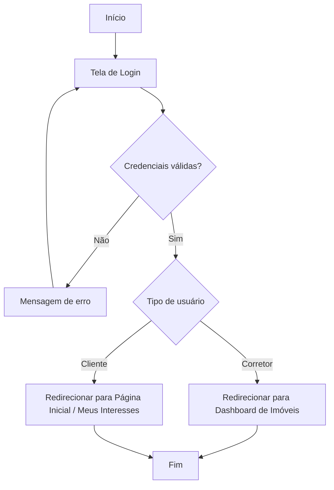
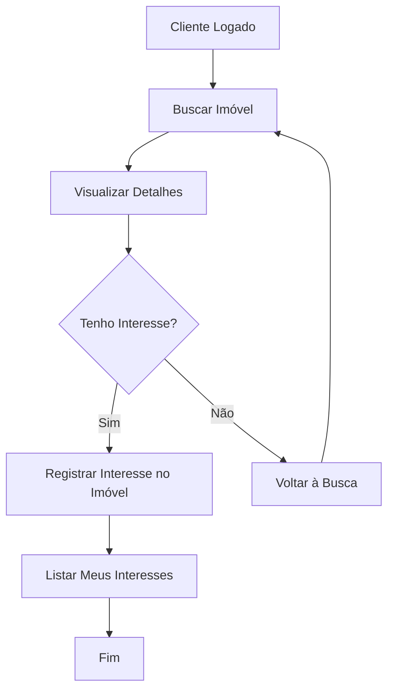
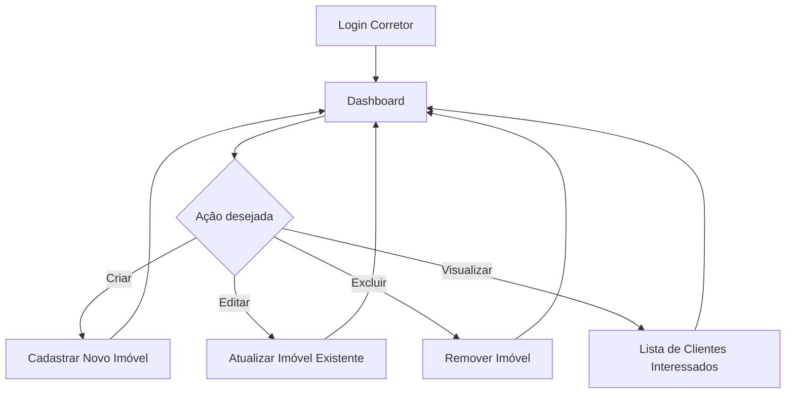
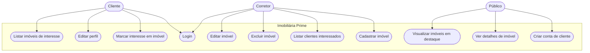
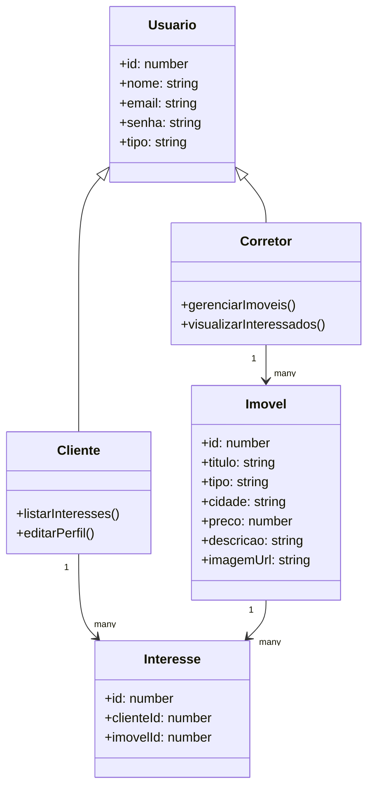

# LEVANTAMENTO DE REQUISITOS 

## Objetivos SMART
Desenvolver metas claras para o fluxo do projeto.

- **Específico**: Desenvolver uma aplicação web que permita cadastro e login de clientes e corretores, gerenciamento de imóveis e registro de interesses. 
- **Mensurável**: Entregar uma aplicação funcional com protótipos, diagramas, CRUD completo e funcionalidades de autenticação dentro do prazo.
- **Atingível**: Utilizar Angular, JSON Server e tecnologias conhecidas, com estrutura modular e escalável.
- **Realista**: Criar um sistema de imobiliária online com dashboard para corretores, sistema de interesses para clientes e controle de acesso por perfil.
- **Tempo**: 3 semanas.  

## Requisitos funcionais
A aplicação deve permitir funcionalidades específicas para cada tipo de usuário.

- **Usuário não logado**: Visualizar página inicial com imóveis em destaque, visualizar detalhes de imóveis, criar conta de cliente.
- **Cliente**: Todas as funcionalidades públicas, marcar imóveis como “Tenho Interesse”, visualizar lista de imóveis de interesse, editar seu próprio perfil. 
- **Corretor**: Login (conta criada por administrador), CRUD de imóveis, visualizar lista de clientes interessados em seus imóveis.

## Requisitos não-funcionais
O sistema deve ser responsivo, seguro e intuitivo.

- Controle de acesso por tipo de usuário (cliente ou corretor) usando Guards do Angular.
- Autenticação com validação de senha.
- Implementação de LocalStorage.  
- Uso de identidade visual (verde-esmeralda, cinza-escuro e branco).

## Recursos humanos
Projeto **individual**, mas organizado em funções caso seja expandido.

- Desenvolvedor Frontend / Designer: Protótipos e componentes Angular.
- Gerente / QA: Testes de usabilidade e fluxo.
- Backend / Dados: Configuração de JSON Server, db.json e simulação de API.

## Recursos tecnológicos
Ferramentas e tecnologias utilizadas para desenvolvimento rápido e eficiente:

- Figma (protótipos UI/UX)
- Angular 16  
- JSON Server  
- Reactive Forms (formulários)
- Local Storage (sessão do usuário)
- Guardas de rota (controle de acesso por perfil)
- SCSS (estilização)

## Cronograma – 1° semana

| Horas | Seg | Ter | Qua 
|-------|-----|-----|-----
| 13h   |     |     | Divisão de tarefas/planejamento |
| 14h   |     |     | Documentação e protótipos no Figma |
| 15h   |     |     | Estrutura do projeto Angular |
| 16h   |     |     | Início do desenvolvimento de componentes |

## Cronograma – 2° semana

| Horas | Seg | Ter | Qua 
|-------|-----|-----|-----
| 13h   |     |     | Desenvolvimento de CRUD e serviços |
| 14h   |     |     | Implementação de guards e autenticação |
| 15h   |     |     | Testes de fluxo e integração |
| 16h   |     |     | Ajustes de design e responsividade |

## Cronograma – 3° semana

| Horas | Seg | Ter | Qua 
|-------|-----|-----|-----
| 13h   |     |     | Revisão geral do projeto |
| 14h   |     |     | Testes finais e correções |
| 15h   |     |     | Preparação do vídeo de apresentação |
| 16h   |     |     | Entrega final e publicação do repositório |

## Diagramas de fluxo

- ### Diagrama de Fluxo – Login e Redirecionamento

- ### Diagrama de Fluxo – Cliente

- ### Diagrama de Fluxo – Corretor

## Diagramas de caso de uso

## Diagrama de classes

## Prototipagem
- ### https://www.figma.com/design/vuGinsihBv6BUXEzxbS1kL/Sem-t%C3%ADtulo--Copy-?node-id=0-1&m=dev&t=VT91QUTEmgyuhdZn-1

